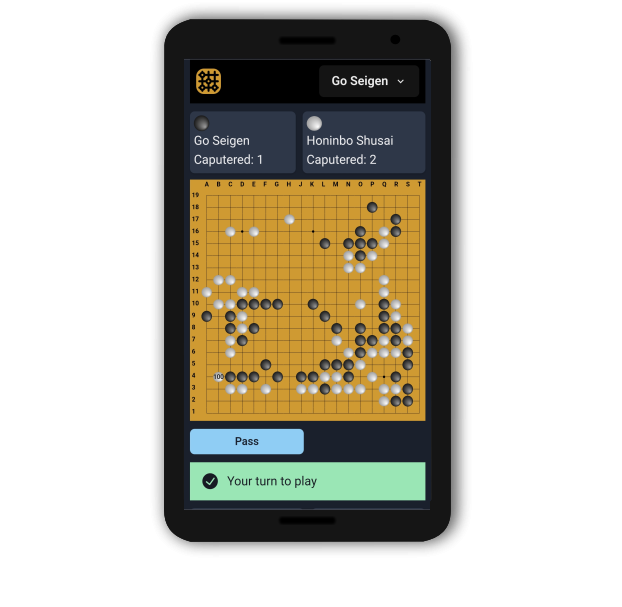
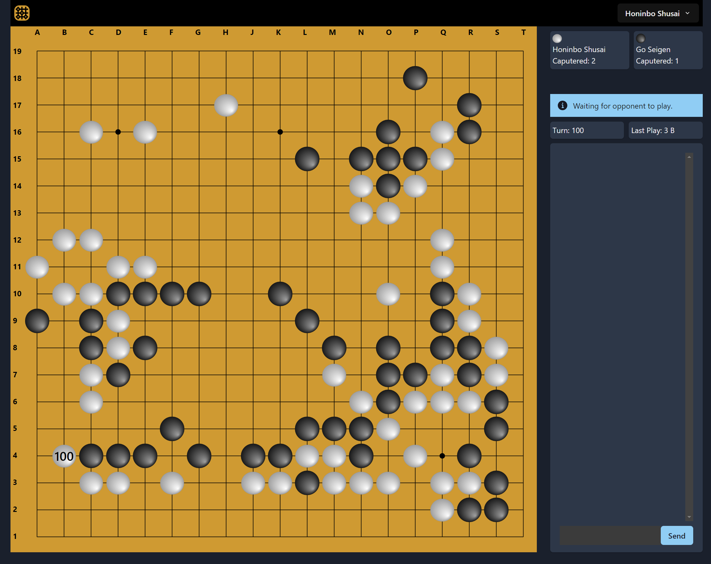

# Go Game Web App using React and TypeScript

This project is an online Go Game powered by React, Typescript and Firestore database (NO-SQL).
<a name="readme-top"></a>


# Responsive Design - As captured on Samung Galaxy s20 Ultra



<!---->

<!---->

# Responsive Design - Dasktop Display



“Go is an abstract strategy board game for two players, in which the aim is to surround more territory than the opponent. The game was invented in China more than 2,500 years ago and is believed to be the oldest board game continuously played to the present day.” Wikipedia

The purpose of the project is to provide an adequately rich problem domain for practicing multiple technologies. 

### Features:

* Referees each play for compliance to Go rules.
* Firebase Authentication for user sign-in.
* Responsive UI (for smart phones etc.)
* Real time chat in game.
* Game board automatically updates when opponent moves.

### Not Implemented:

* Handicap Game
* Games on Smaller Boards (only 19x19 supported)
* Final Scoring of games
* AI opponent (you can only play against people)
* Go Game Tutorial

# Try it right now!
Click on the link below to start playing Go.

* https://auth-react-dev-29188.web.app/auth/login   (the online Go Game).

Another purpose of this website is to allow interested persons to easily see my work. To facilitate this, I have provided two accounts with easy usernames and passwords so that you can view the site without "signing up". This allows you to quickly access games-in-progress without needing to recruit a friend to play against you. Though, if you want to, you definitely can play against each other using these two credentials.  There is of course the possibility that two of you will log in as the same "test subject".  This could result confusing events.

You are also welcome to sign up. A "real" email is not required as email verification has been turned off, but if you use a fake email address, you will not be able to use "forgot password".

### Test Accounts for logging in to view the website:

     Test Account email A: roo2@roo2.com

     Test Account password A: 12345678


     Test Account email B: roo3@roo3.com 

     Test Account password B: 12345678

Please consider providing any feedback at this email address: twowaypress@gmail.com


### Built With


* [![React][React.js]][React-url]
* ![TypeScript]
* ![FireBase]
* ![Chakra-ui]
* ![Zustand]


<p align="right">(<a href="#readme-top">back to top</a>)</p>


<!-- GETTING STARTED -->
## Getting Started


### Prerequisites

This is an example of how to list things you need to use the software and how to install them.
* npm
  ```sh
  npm install npm@latest -g
  ```
* [setup Firebase Authentication.](./docs/getting-started/setup-firebase-authentication.md)
* [setup Firestore Database.](./docs/getting-started/setup-firestore-database.md)

### Installation


1. Clone the repo
   ```sh
   git clone https://github.com/steveLeVesconte/go-game-webapp-react-typescript.git
   ```
2. Install NPM packages
   ```sh
   npm install
   ```
3. Enter your FIREBASE secrets in `/firestore.config.ts`
   ```js
    export const firebaseConfig ={
    apiKey: "[your api key here]",
    authDomain: "[your authDomain here]",
    projectId:"[your projectId here]",
    storageBucket: "[your storageBucket here]",
    messagingSenderId: "[your messagingSenderId: here]",
    appId: "[your appId here]",
    measurementId: "[your measurementId here]",
     };

   ```

Note: To find your Firebase secrets, click on the gear in the upper left corner of your "Project Overview" and choose "Project Settings".

<p align="right">(<a href="#readme-top">back to top</a>)</p>


<!-- MARKDOWN LINKS & IMAGES -->
<!-- https://www.markdownguide.org/basic-syntax/#reference-style-links -->
[contributors-shield]: https://img.shields.io/github/contributors/othneildrew/Best-README-Template.svg?style=for-the-badge
[contributors-url]: https://github.com/othneildrew/Best-README-Template/graphs/contributors
[forks-shield]: https://img.shields.io/github/forks/othneildrew/Best-README-Template.svg?style=for-the-badge
[forks-url]: https://github.com/othneildrew/Best-README-Template/network/members
[stars-shield]: https://img.shields.io/github/stars/othneildrew/Best-README-Template.svg?style=for-the-badge
[stars-url]: https://github.com/othneildrew/Best-README-Template/stargazers
[issues-shield]: https://img.shields.io/github/issues/othneildrew/Best-README-Template.svg?style=for-the-badge
[issues-url]: https://github.com/othneildrew/Best-README-Template/issues
[license-shield]: https://img.shields.io/github/license/othneildrew/Best-README-Template.svg?style=for-the-badge
[license-url]: https://github.com/othneildrew/Best-README-Template/blob/master/LICENSE.txt
[linkedin-shield]: https://img.shields.io/badge/-LinkedIn-black.svg?style=for-the-badge&logo=linkedin&colorB=555
[linkedin-url]: https://linkedin.com/in/othneildrew
[product-screenshot]: images/screenshot.png
[Firebase]: https://img.shields.io/badge/Firebase-039BE5?style=for-the-badge&logo=Firebase&logoColor=white
[Next-url]: https://nextjs.org/
[React.js]: https://img.shields.io/badge/React-20232A?style=for-the-badge&logo=react&logoColor=61DAFB
[React-url]: https://reactjs.org/
[TypeScript]: https://img.shields.io/badge/typescript-blue?style=for-the-badge&logo=typescript&logoColor=white
[Vue-url]: https://vuejs.org/
[Chakra-ui]: https://img.shields.io/badge/chakra-%234ED1C5.svg?style=for-the-badge&logo=chakraui&logoColor=white
[Angular-url]: https://angular.io/
[Svelte.dev]: https://img.shields.io/badge/Svelte-4A4A55?style=for-the-badge&logo=svelte&logoColor=FF3E00
[Svelte-url]: https://svelte.dev/
[Laravel.com]: https://img.shields.io/badge/Laravel-FF2D20?style=for-the-badge&logo=laravel&logoColor=white
[Laravel-url]: https://laravel.com
[Zustand]: https://img.shields.io/badge/Zustand-blue?style=for-the-badge&logo=bear

[Bootstrap-url]: https://getbootstrap.com
[JQuery.com]: https://img.shields.io/badge/jQuery-0769AD?style=for-the-badge&logo=jquery&logoColor=white
[JQuery-url]: https://jquery.com 
